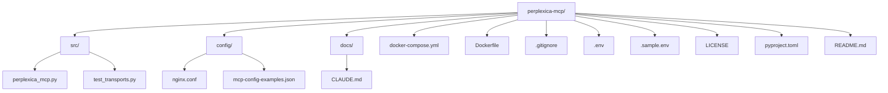

# Repository Structure

Here is the suggested new structure for the repository:

## Explanation of Changes

* **`src/` (or `app/`)**: This directory would contain all the primary application source code.
  * `perplexica_mcp.py`
  * `test_transports.py`
* **`config/`**: This directory would hold configuration files that are not directly part of the application's source code but configure its environment or external services.
  * `nginx.conf`
  * `mcp-config-examples.json`
* **`docs/`**: A dedicated directory for documentation files.
  * `CLAUDE.md`
* **Root Directory**: Files that are essential for the project's overall management or are typically found at the root level remain here.
  * `docker-compose.yml`
  * `Dockerfile`
  * `.gitignore`
  * `.env` (the actual environment file, which should be ignored by Git)
  * `.sample.env` (a template for the `.env` file)
  * `LICENSE`
  * `pyproject.toml`
  * `README.md`
  * `CHANGELOG.md`
